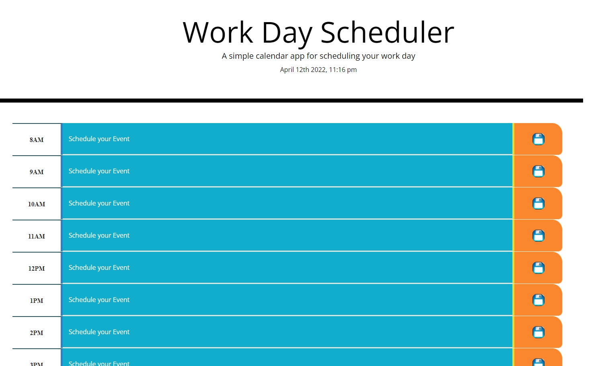

# Work-Day-Scheduler

# This project is an agenda that allows a user to save an event along the business hours. 

#   TECHNOLOGIES USED

* I created this proyect with HTML, CSS, Bootstrap, JavaScript and some API's like moment.js to display the actual date on the web and jQuery.

# Challenges 

* I had a little troubles with the local storage in order to save the users event properly and that was a good challenge because now I can understand how the local storage works and how I can use it propperly.

# HOW IT WORKS

* The user just need to click on "Schedule your Event" and type event and to save that event just need to click on the save image.

# SCREENSHOTS

# LINK TO THE DEPLOYED WEB
https://angelmond.github.io/Work-Day-Scheduler/
